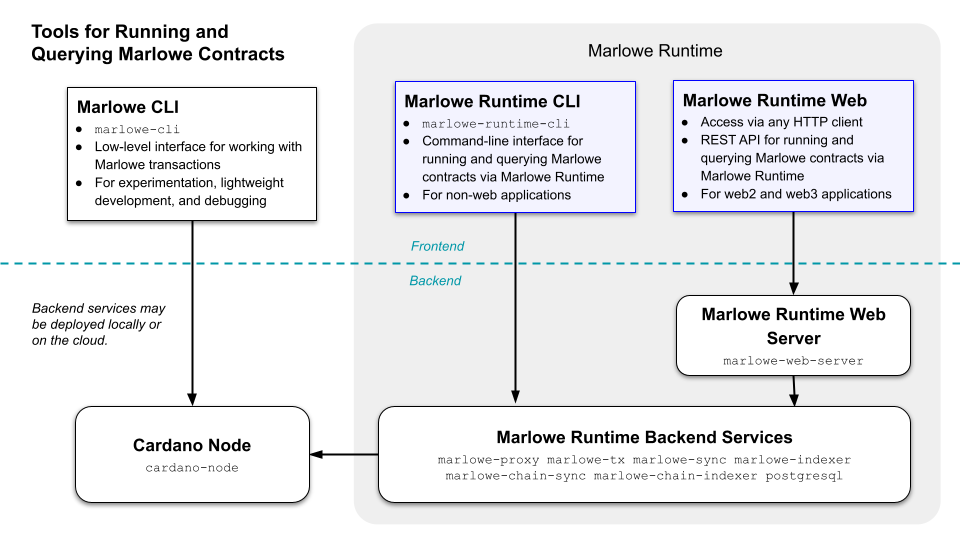

# Starter Kit for Marlowe

- [Marlowe Tools](#marlowe-tools)
- [Marlowe Runtime](#marlowe-runtime)
- [Using Marlowe Safely](#using-marlowe-safely)
- [Lessons](#lessons)
    - [0. Preliminaries](./00-preliminaries.ipynb)
    - [1. Zero-Coupon Bond using the Marlowe Runtime command-line client](01-runtime-cli/ReadMe.ipynb)
    - [2. Zero-Coupon Bond using the Marlowe Runtime REST API](02-runtime-rest/ReadMe.ipynb)


---


This repository is meant to be used with [demeter.run](https://demeter.run) to execute Marlowe contracts using Marlowe Runtime, or with a docker deployment of Marlowe Runtime. See the [Marlowe documentation](https://github.com/input-output-hk/marlowe-doc/blob/main/README.md) for more information on Marlowe and Marlowe Runtime.

If you are unfamiliar with the Marlowe smart-contract language or with the Cardano blockchain, you may want to familiarize yourself with the following information:

1. [The Marlowe Language](https://marlowe-finance.io/)
2. [Cardano's Extended UTxO Model](https://docs.cardano.org/learn/eutxo-explainer).


### Nix

If you have the [Nix package manager installed](https://nix.dev/tutorials/install-nix) with [Nix flakes support enabled](https://nixos.wiki/wiki/Flakes#Enable_flakes), you can launch a Jupyter notebook server, open a development environment, or build the tools.


#### Launching a Jupter Server for Marlowe Tools

You can launch a Jupyter notebook server for the workbooks and tools as follows:

```console
$ git clone git@github.com:input-output-hk/marlowe-starter-kit/
$ cd marlowe-starter-kit
$ nix run
```

#### Opening a Development Shell

One can also enter a Nix development shell that contains the Marlowe tools:

```console
$ git clone git@github.com:input-output-hk/marlowe-starter-kit/
$ cd marlowe-starter-kit
$ nix develop
```


#### Building individual Tools

One can build individual Marlowe tools using Nix:

```bash
nix build github:input-output-hk/marlowe-starter-kit/#marlowe      -o build/marlowe
nix build github:input-output-hk/marlowe-starter-kit/#marlowe-cli  -o build/marlowe-cli
nix build github:input-output-hk/marlowe-starter-kit/#marlowe-pipe -o build/marlowe-pipe
```


## Marlowe Tools

Three alternative workflows are available for running Marlowe contracts:

1. Marlowe CLI (`marlowe-cli`) for lightweight experiments with Marlowe transactions.
2. Marlowe Runtime CLI (`marlowe`) for non-web applications that use the Marlowe Runtime backend services.
3. Marlowe Runtime Web (`marlowe-web-server`) for web applications that use Marlowe Runtime backend services.

Marlowe Runtime provides a variety of transaction-building, UTxO management, querying, and submission services for using Marlowe contracts: this makes it easy to run Marlowe contracts without attending to the details of the Cardano ledger and Plutus smart contracts. On the contrary, Marlowe CLI does not support querying and UTxO management, so it is best suited for experienced Cardano developers.




## Marlowe Runtime

Marlowe Runtime consists of several backend services and work together with a web server.


## Using Marlowe Safely

If one plans to run a Marlowe contract on the Cardano `mainnet`, then one should check its safety before creating it, so that there is no chance of losing funds.

Here are the steps for checking the safety of a contract:

1. Understand the [Marlowe Language](https://marlowe-finance.io/)
2. Understand Cardano\'s [Extended UTxO Model](https://docs.cardano.org/learn/eutxo-explainer).
3. Read and understand the [Marlowe Best Practices Guide](https://github.com/input-output-hk/marlowe-cardano/blob/main/marlowe/best-practices.md).
4. Read and understand the [Marlowe Security Guide](https://github.com/input-output-hk/marlowe-cardano/blob/main/marlowe/security.md).
5. Use [Marlowe Playground](https://play.marlowe-finance.io/) to flag warnings, perform static analysis, and simulate the contract.
6. Use [Marlowe CLI\'s](https://github.com/input-output-hk/marlowe-cardano/blob/main/marlowe-cli/ReadMe.md) `marlowe-cli run analyze` tool to study whether the contract can run on a Cardano network.
7. Run *all execution paths* of the contract on a [Cardano testnet](https://docs.cardano.org/cardano-testnet/overview).


## Lessons

- [Lesson 0. Preliminaries](00-preliminaries.ipynb): This lesson describes how to create and fund the Cardano addresses used in the lessons in this starter kit.
- [Lesson 1. Marlowe Runtime's Command-Line Interface](01-runtime-cli/ReadMe.ipynb): This lesson shows how to use Marlowe Runtime to execute a zero-coupon bond contract using the command line for a Cardano testnet.
- [Lesson 2. Marlowe Runtime's REST Interface](02-runtime-rest/ReadMe.ipynb): This lesson shows how to use the REST API for Marlowe Runtime to execute a zero-coupon bond contract on a Cardano testnet.
